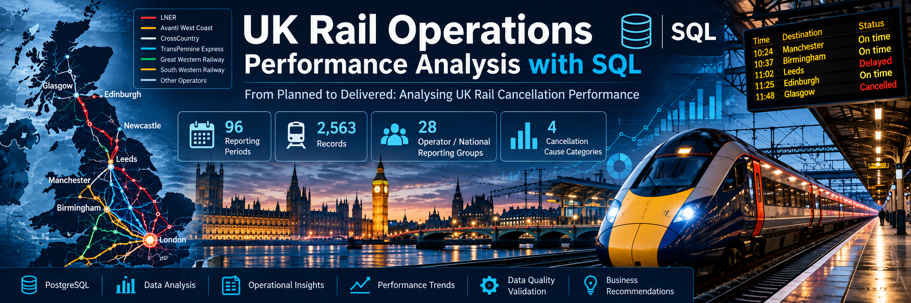
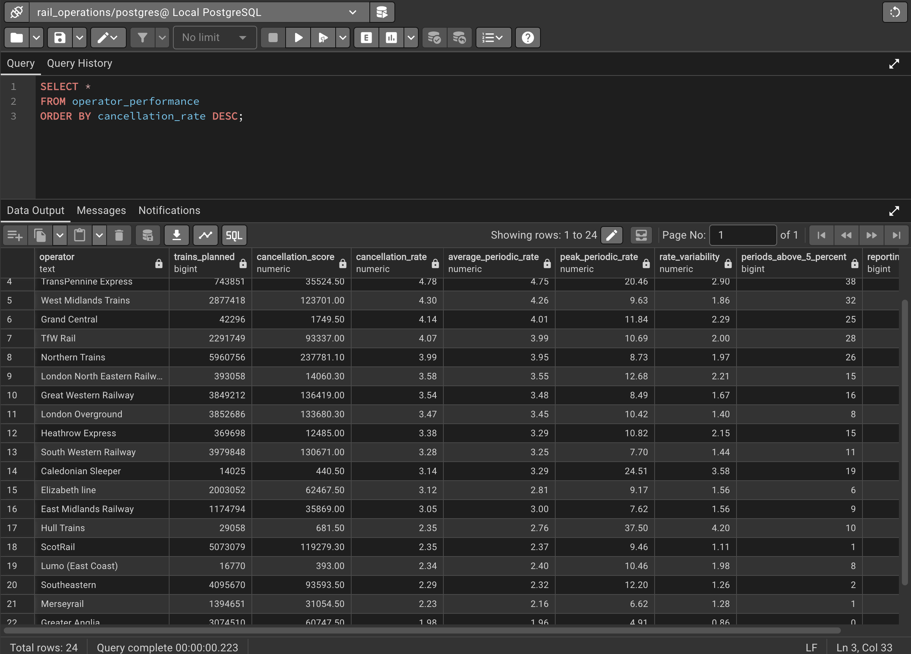
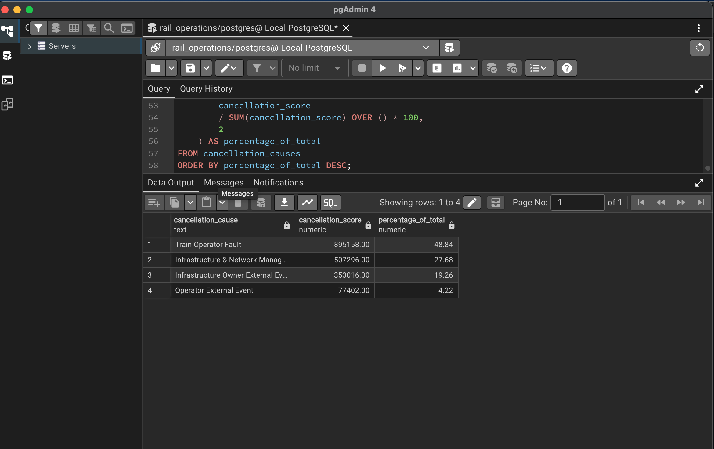
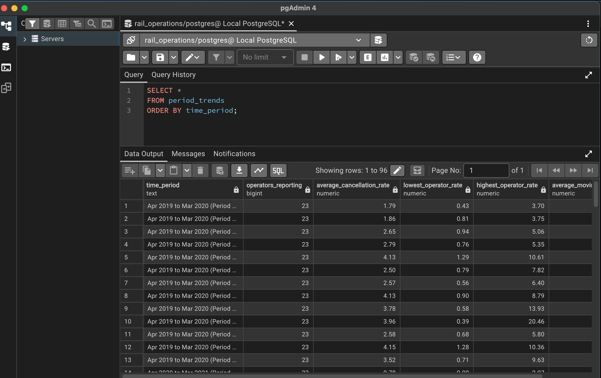
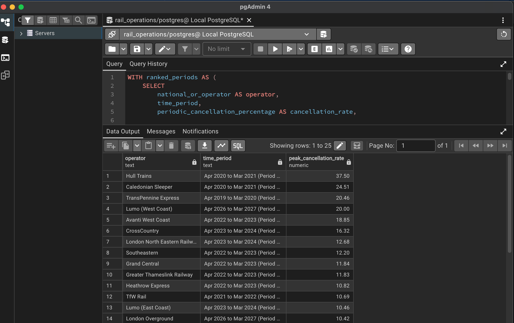

# UK Rail Operations Performance Analysis with SQL



## From Planned to Delivered: Analysing UK Rail Cancellation Performance

A SQL-based analysis of UK rail cancellation performance using official Office of Rail and Road (ORR) data.

The project investigates operator performance, cancellation causes, reporting-period trends, consistency and data quality using PostgreSQL.

---

## Project Overview

Rail operators plan thousands of train services across the UK every reporting period. When services are cancelled or partially cancelled, it can affect passengers, operations and network performance.

This project uses SQL to investigate:

- How cancellation performance differs between operators
- Which cancellation causes contribute most to the cancellation score
- How cancellation performance changes across reporting periods
- Which operators show greater variation in performance
- Which periods show unusually high cancellation rates
- Whether the underlying dataset passes key data-quality checks

The analysis is designed as a portfolio project demonstrating practical SQL and analytical skills.

---

## Business Questions

The analysis addresses the following questions:

1. How many records and reporting periods are contained in the dataset?
2. How does cancellation performance differ between operators?
3. Which high-volume operators have higher calculated cancellation-score rates?
4. What are the main recorded cancellation causes?
5. How does cancellation performance change between reporting periods?
6. Which operators show greater variability in cancellation rates?
7. How frequently does each operator exceed a 5% cancellation rate?
8. Which operators experience the highest individual reporting-period cancellation rates?
9. Does the dataset contain duplicate or invalid records?
10. How closely does the recorded cancellation score correspond with the underlying cancellation components?

---

## Key Findings

### 1. Operator Cancellation Performance

The analysis calculates cancellation performance using the ORR cancellation score relative to trains planned.

| Operator | Trains Planned | Cancellation Score | Calculated Cancellation Rate |
|---|---:|---:|---:|
| CrossCountry | 609,609 | 34,462.60 | 5.65% |
| Avanti West Coast | 635,177 | 34,420.00 | 5.42% |
| Greater Thameslink Railway | 8,250,801 | 411,935.70 | 4.99% |
| TransPennine Express | 743,851 | 35,524.50 | 4.78% |
| West Midlands Trains | 2,877,418 | 123,701.00 | 4.30% |
| Grand Central | 42,296 | 1,749.50 | 4.14% |
| TfW Rail | 2,291,749 | 93,337.00 | 4.07% |
| Northern Trains | 5,960,756 | 237,781.10 | 3.99% |

The results show variation in cancellation performance across operators and demonstrate why operator-level comparison is useful for operational performance analysis.

---

## SQL Results

## SQL Results

### 1. Operator Performance

The master operator KPI query provides a consolidated view of planned trains, cancellation score, cancellation rate, average periodic rate, peak rate and variability.



*PostgreSQL query output — operator performance KPIs.*

---

### 2. Cancellation Causes

The cancellation-cause analysis breaks the recorded cancellation score into four responsibility categories.



*PostgreSQL query output — cancellation cause analysis.*

---

### 3. Reporting-Period Trends

The period-trend analysis compares cancellation performance across the 96 reporting periods.



*PostgreSQL query output — reporting-period trend analysis.*

---

### 4. Peak Cancellation Periods

This analysis identifies the highest individual reporting-period cancellation rate recorded for each operator.



*PostgreSQL query output — operator peak cancellation periods.*

### 2. Cancellation Causes

The cancellation-cause analysis identified four ORR responsibility categories:

| Cancellation Cause | Cancellation Score | Share of Total |
|---|---:|---:|
| Train Operator Fault | 895,158.00 | 48.84% |
| Infrastructure & Network Management | 507,296.00 | 27.68% |
| Infrastructure Owner External Event | 353,016.00 | 19.26% |
| Operator External Event | 77,402.00 | 4.22% |

Train Operator Fault represents the largest share of the analysed cancellation score, followed by Infrastructure & Network Management.

> Note: ORR cancellation responsibility categories should not be interpreted as mutually exclusive counts of cancelled trains. They represent cancellation scores attributed to different responsibility categories.

---

### 3. Reporting-Period Variation

The reporting-period analysis uses SQL aggregation and window functions to examine changes in cancellation performance over time.

The analysis calculates:

- Average cancellation percentage
- Lowest operator cancellation percentage
- Highest operator cancellation percentage
- Period-on-period change
- Moving annual average comparison

`LAG()` is used to compare each reporting period with the previous period and identify significant changes in performance.

---

### 4. Operator Consistency

Operator-level consistency was analysed using:

- Average cancellation rate
- Peak periodic cancellation rate
- Rate variability
- Number of reporting periods above 5%
- Reporting-period coverage

This helps distinguish operators with consistently similar performance from those experiencing greater variation between reporting periods.

---

### 5. Data Quality

The project also performs validation checks for:

- Missing values
- Duplicate operator-period records
- Negative operational values
- Cancellation rates above 100%
- Cancellation-score reconciliation
- Operator reporting coverage

These checks help ensure that the SQL analysis is based on a validated analytical dataset rather than simply querying the raw CSV.

## Dataset

**Source:** Office of Rail and Road (ORR)

**Dataset:** Table 3124 – Trains planned and cancellations by operator (periodic)

The dataset contains information including:

- Reporting period
- Operator
- Trains planned
- Part-cancelled trains
- Fully cancelled trains
- Cancellation number / cancellation score
- Infrastructure & network management
- Infrastructure owner external events
- Train operator fault
- Operator external events
- Periodic cancellation percentage
- Moving annual average percentage

### Dataset size

- **2,563 records**
- **96 reporting periods**
- **28 operator/national reporting groups**
- **24 operators with sufficient periodic cancellation data for the consistency analysis**

National aggregate rows such as Great Britain, England and Wales, and Scotland were excluded from operator-level comparisons to avoid mixing aggregate and operator-level results.

---

## Tools & Technologies

| Tool | Purpose |
|---|---|
| PostgreSQL | Data storage and SQL analysis |
| pgAdmin 4 | Database management and query development |
| SQL | Cleaning, aggregation and analysis |
| GitHub | Version control and portfolio presentation |
| ORR Open Data | Source dataset |

---

# Data Preparation

The original CSV contained `[z]` values in some percentage fields.

A raw staging table was first created so the source data could be imported without type-conversion errors.

The data was then transformed into the analytical table using:

- `NULLIF()`
- `TRIM()`
- Type casting
- Numeric conversion
- Missing-value handling

The cleaned dataset was stored in the `rail_cancellations` table.

### Data-quality checks

The analysis also checks for:

- Missing values
- Duplicate operator-period records
- Negative operational values
- Cancellation rates above 100%
- Cancellation-score reconciliation
- Operator reporting coverage

---

# SQL Analysis

## 1. Operator Performance

Operator-level cancellation performance was calculated using:

```sql
SUM(cancellation_number)
/
SUM(trains_planned)
* 100

## Project Structure

```text
uk-rail-operations-sql-analysis/
│
├── sql/
│   ├── 01_data_cleaning.sql
│   ├── 02_operator_analysis.sql
│   ├── 03_cancellation_causes.sql
│   ├── 04_trend_analysis.sql
│   ├── 05_operator_consistency.sql
│   ├── 06_data_quality_validation.sql
│   └── 07_final_kpis.sql
│
├── README.md
└── data/
    └── ORR Table 3124 dataset
